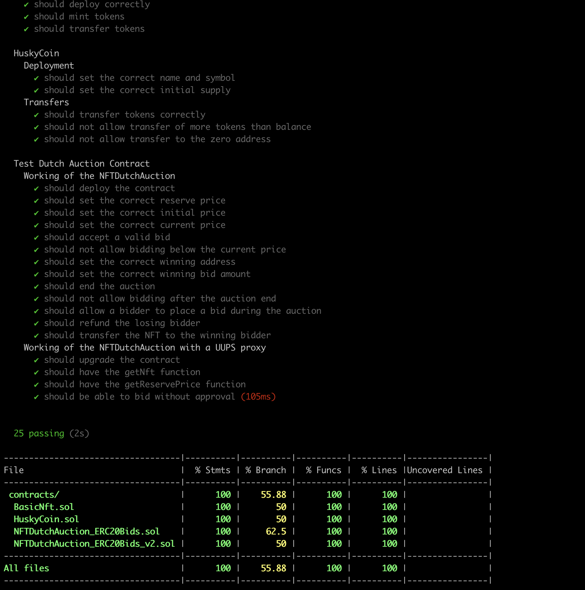

# Basic Dutch Auction - Assignment 4
### Name: Arjun Raja Yogidas
### NUID: 002964082

The NFTDutchAuction_ERC20Bids_v2.sol contract works as follows:

- We use UUPS proxy mechanism.
- All bids are to be made using HuskyCoins an ERC20Permit token.
- The seller instantiates a DutchAuction contract to manage the auction of a single, nft item at a single auction event. The contract is initialized with the following parameters: 
    - _erc20TokenAddress: the address of the HuskyCoin contract
    - _erc721TokenAddress: Address of the Nft contract
    - _nftTokenId: unique token id
    - reservePrice: the minimum amount of HUSKY coin that the seller is willing to accept for the item 
    - numBlocksAuctionOpen: the number of blockchain blocks that the auction is open for
    - offerPriceDecrement: the amount of HUSKY coin that the auction price should decrease by during each subsequent block. 
- The seller is the owner of the contract. 
- Nft's are minted by the owner here for reduced comlexity
- Nft contract approves the required addresses for the auction to continue uninterupted
- The auction begins at the block in which the contract is created. 
- The initial price of the item is derived from reservePrice, numBlocksAuctionOpen, and  offerPriceDecrement: initialPrice = reservePrice + numBlocksAuctionOpen*offerPriceDecrement 
- A bid can be submitted by any Ethereum externally-owned account. 
- The first bid processed by the contract that sends HUSKY coin greater than or equal to the current price is the  winner. The HUSKY coin should be transferred immediately to the seller and the contract should not accept  any more bids. All bids besides the winning bid should be refunded immediately. 
- With the ERC20Permit for the HuskyCoin we can Bid along with giving approval and don't need to make another call for the same. Just call the bidWithPermit function along with the signature params to bid without pre approval

```shell
npx hardhat compile //to compile
npx hardhat run scripts/deployBDA.ts //to deploy
npx hardhat test //to run test cases
npx hardhat coverage //to generate coverage report
```
## Test Coverage Report
